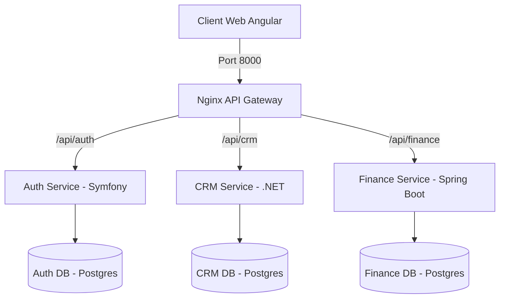

<p align="center">
  
</p>

<h1 align="center">MAKA — ERP Modulaire Microservices</h1>

<p align="center">
  <strong>Solution ERP moderne et modulaire pour la gestion d'entreprise</strong><br>
  CRM · Finance · Administration Globale
</p>

<p align="center">
  
  
  
  
  
  
  
</p>

---

## 📋 Présentation

Le projet **MAKA** est un ERP (Enterprise Resource Planning) conçu pour centraliser la gestion d'une entreprise au sein d'une interface très moderne (Dark/Light mode, Glassmorphism). L'architecture repose sur des **microservices indépendants ultra-sécurisés**. Chaque équipe a utilisé la technologie la plus adaptée à son domaine métier, et les services dialoguent ensemble via une **API Gateway Nginx**.

### Objectifs
- Fournir une solution **modulaire** et **scalable** (sans Single Point of Failure).
- Séparer hermétiquement les bases de données métiers.
- Permettre un accès **multi-rôles** intelligent avec des jetons cryptographiques RSA (Admin, Commercial, Manager Finance).

---

## 🏗️ Architecture Technique



Chaque module est un **microservice indépendant** avec sa propre base de données.

---

## 🧩 Modules du Projet

| Module | Technologie | Base de données | Architecture | État |
|--------|-------------|-----------------|--------------|------|
| **Auth Service** | Symfony 7 / PHP 8.3 | PostgreSQL 16 | JWT Asymétrique | ✅ Terminé |
| **CRM Service** | .NET Core 8 | PostgreSQL 16 | Clean Architecture | ✅ Terminé |
| **Finance Service** | Java 17 / Spring Boot 3 | PostgreSQL 16 | MVC Standard | ✅ Terminé |
| **Frontend** | Angular 17+ | — | Standalone API | ✅ Terminé |
| **API Gateway** | Nginx Alpine | — | Reverse Proxy | ✅ Terminé |

---

## 🚀 Fonctionnalités Actuelles

### 1. Panel d'Administration (Symfony / Angular)
Le cœur de la sécurité du système. Modèle de contrôle d'accès strict (RBAC).
- Génération de clés privées/publiques RSA pour signer les tokens.
- Connexion fluide (Bcrypt ultra rapide).
- Dashboard d'administration exclusif pour changer librement le rôle de n'importe quel employé de manière instantanée.

### 2. Module CRM (.NET 8)
Le cœur de l'activité commerciale. Réservé aux commerciaux et admins.
- **Tableau de bord** : Vue synthétique des prospects et clients existants.
- **Leads & Opportunités** : Capture de prospects, évolution vers de véritables opportunités financières (pipeline structuré).
- **Comptes & Contacts** : Fichier global des entreprises partenaires.
- **Interactions** : Tickets de supports technique et tâches associées.

### 3. Module Finance (Spring Boot 3)
Opérations monétaires et comptabilité pures, réservées aux managers financiers.
- **Journal Comptable** : Vue intégrale chiffrée.
- **Factures & Paiements** : Émission de factures avec calcul de TVA et gestion du règlement financier.
- **Comptes Bancaires** : Suivi de la trésorerie.

---

## 🔐 Authentification & Sécurité Séparée (JWT RSA)

Notre grand atout architectural : le service Finance (Java) et le service CRM (.NET) sécurisent leurs portes **sans jamais interroger la base de données Auth (PHP)**. 

Lorsque le *Auth Service* connecte un utilisateur, il produit un jeton JWT contenant son rôle (ex: `COMMERCIAL`), et le **signe avec une clé privée**. Le CRM possède uniquement la **clé publique**, lui permettant de vérifier instantanément et hors-ligne l'authenticité du jeton avant d'autoriser l'affichage des contenus. 

| Rôle | Accès CRM | Accès Finance | Accès Admin |
|----------|-----------|---------|---------|
| **ADMIN** | ✅ Intégral | ✅ Intégral | ✅ (Gestion rôles) |
| **FINANCE_MANAGER** | ❌ Interdit | ✅ Intégral | ❌ Interdit |
| **COMMERCIAL** | ✅ Intégral | ❌ Interdit | ❌ Interdit |

---

## 🏁 Démarrage Rapide (Lancement)

**Prérequis** : Docker Desktop et Node.js installés.

### 1. Cloner le projet
```bash
git clone https://github.com/MarouanKiker/MAKA.git
cd MAKA
```

### 2. Lancer les microservices (Backend)
Les services incluent un volume interne spécifiquement optimisé pour contrer les lenteurs habituelles du système de fichiers monté sur WSL2 (OPcache & Vendor RAM).

```bash
cd services
# Supprimez les anciennes versions (si existantes)
docker compose down
# Lancez la compilation et les serveurs
docker compose up -d --build
```

### 3. Lancer le frontend (Terminal séparé)
```bash
cd frontend
npm install
npm start
```

### 4. Accéder à l'application
- **Application Globale :** `http://localhost:4200`
- API Gateway (Routage central Backend) : `http://localhost:8000`
- *Le compte administrateur racine (marouankiker@gmail.com / admin123) est disponible d'office pour gérer initialement la flotte grâce aux scripts de seed.*

---

## 👥 Équipe de Développement
- **Marwan Kiker**
- **Abdellah Ajebli**
- **Abdelilah Hamdaoui**
- **Abderahmane Missaoui**

