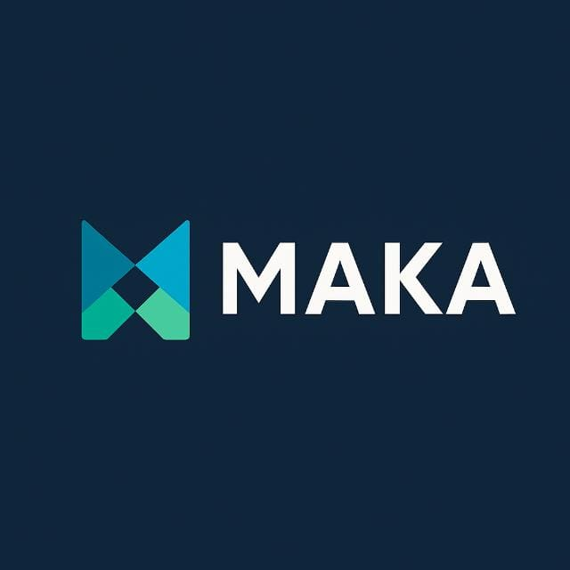

<p align="center">
  
</p>

<h1 align="center">MAKA — ERP Modulaire Microservices</h1>

<p align="center">
  <strong>Solution ERP moderne et modulaire pour la gestion d'entreprise</strong><br>
  CRM · Stock · Ventes & Achats · RH · Finance
</p>

<p align="center">
  
  
  
  
  
  
</p>

---

## 📋 Présentation

Le projet **MAKA** est un ERP (Enterprise Resource Planning) conçu pour centraliser la gestion d'une entreprise au sein d'une interface unique. L'architecture repose sur des **microservices indépendants**, chacun utilisant la technologie la plus adaptée à son domaine métier, communiquant via une **API Gateway Nginx**.

### Objectifs
- Fournir une solution **modulaire** et **scalable**
- Centraliser les processus critiques : relation client, stocks, ventes, achats et ressources humaines
- Permettre un accès **multi-rôles** sécurisé (Admin, Commercial, Support, RH, Comptable)

---

## 🏗️ Architecture

```
    Client Web                    Admin Client
   (Utilisateurs)              (Administrateur)
         │                            │
         └────────────┬───────────────┘
                      ▼
            ┌──────────────────┐
            │  API Gateway     │
            │  (Nginx :80)     │
            └────────┬─────────┘
                     ▼
            ┌──────────────────┐
            │  Service Auth    │
            │  (Symfony / JWT) │
            └────────┬─────────┘
                     │
     ┌───────┬───────┼───────┬───────┐
     ▼       ▼       ▼       ▼       ▼
  ┌──────┐┌──────┐┌──────┐┌──────┐┌──────┐
  │ CRM  ││  RH  ││Finan.││Stock ││Ventes│
  │.NET  ││Java  ││Java  ││Symf. ││Python│
  └──┬───┘└──┬───┘└──┬───┘└──┬───┘└──┬───┘
     ▼       ▼       ▼       ▼       ▼
    DB       DB      DB      DB      DB
```

Chaque module est un **microservice indépendant** avec sa propre base de données.

---

## 🧩 Modules

| Module | Technologie | Base de données | Port | État |
|--------|-------------|-----------------|------|------|
| **Auth Service** | Symfony 7 / PHP 8.3 | PostgreSQL 16 | 9000 (FPM) | ✅ Fonctionnel |
| **CRM Service** | .NET Core 8 | PostgreSQL 16 | 5000 | 🔧 En cours |
| **Stock Service** | Symfony 7 / PHP | À définir | — | 📋 Planifié |
| **Ventes & Achats** | Python FastAPI | À définir | — | 📋 Planifié |
| **RH Service** | Java Spring Boot 3 | À définir | — | 📋 Planifié |
| **Finance Service** | Java Spring Boot 3 | À définir | — | 📋 Planifié |
| **Frontend** | Angular 17+ | — | 4200 | ✅ Fonctionnel |
| **API Gateway** | Nginx Alpine | — | 80 | ✅ Fonctionnel |

---

## 🚀 Module CRM (Développement actif)

Le module CRM est le cœur de l'activité commerciale. Il gère :

### Fonctionnalités implémentées (Frontend)
- 📊 **Dashboard** — Vue synthétique avec KPIs (comptes, contacts, leads, opportunités, tickets, tâches)
- 🏢 **Comptes** — Gestion des clients/entreprises (CRUD)
- 👤 **Contacts** — Gestion des personnes liées aux comptes
- 🎯 **Leads** — Capture et qualification des prospects (pipeline Kanban drag & drop)
- 📈 **Opportunités** — Suivi du pipeline de ventes (Kanban drag & drop)
- ✅ **Tâches** — Gestion des tâches liées aux leads/opportunités (Kanban drag & drop)
- 🎫 **Tickets** — Support client avec gestion des priorités (Kanban drag & drop)
- 📢 **Campagnes** — Campagnes marketing avec suivi

### Rôles et droits (RBAC)

| Fonction | Admin | Commercial | Support |
|----------|-------|-----------|---------|
| Comptes (CRUD) | ✅ | ✅ | 👁️ Lecture |
| Contacts (CRUD) | ✅ | ✅ | 👁️ Lecture |
| Leads (CRUD) | ✅ | ✅ | 👁️ Lecture |
| Conversion Lead→Opportunité | ✅ | ✅ | ❌ |
| Opportunités (CRUD) | ✅ | ✅ | 👁️ Lecture |
| Tâches (CRUD) | ✅ | ✅ | 👁️ Lecture |
| Tickets (CRUD) | ✅ | 👁️ Lecture | ✅ |
| Campagnes (CRUD) | ✅ | 👁️ Lecture | ❌ |
| Interactions (CRUD) | ✅ | ✅ | ✅ |

---

## 🔐 Authentification

Le système d'authentification est centralisé via le **Auth Service** (Symfony 7 + LexikJWT) :

- **JWT** (JSON Web Token) pour l'authentification stateless
- **Bcrypt** pour le hashage des mots de passe
- **Refresh tokens** avec rotation automatique
- **Hiérarchie des rôles** : `ROLE_ADMIN` → `ROLE_COMMERCIAL` / `ROLE_SUPPORT` → `ROLE_USER`

### Endpoints Auth

| Méthode | Route | Description | Auth |
|---------|-------|-------------|------|
| POST | `/api/auth/register` | Inscription | Non |
| POST | `/api/auth/login` | Connexion (retourne JWT) | Non |
| GET | `/api/auth/profile` | Profil utilisateur | JWT |
| PUT | `/api/auth/change-password` | Changer mot de passe | JWT |
| POST | `/api/auth/forgot-password` | Demande de reset | Non |
| POST | `/api/auth/reset-password` | Reset avec token | Non |
| POST | `/api/auth/token/refresh` | Renouveler le JWT | Non |
| POST | `/api/auth/logout` | Déconnexion | JWT |

---

## ⚙️ Prérequis

- **Docker Desktop** 24+ avec Docker Compose
- **Node.js** 18+ et **npm** (pour le développement frontend)
- **Git**

---

## 🏁 Démarrage rapide

### 1. Cloner le projet
```bash
git clone https://github.com/MarouanKiker/MAKA.git
cd MAKA
```

### 2. Lancer les microservices (Backend)
```bash
cd services
docker-compose up -d --build
```

### 3. Créer les tables de la base de données
```bash
docker exec auth-service php bin/console doctrine:schema:update --force
```

### 4. Lancer le frontend
```bash
cd frontend
npm install
npm start
```

### 5. Accéder à l'application
| Service | URL |
|---------|-----|
| Frontend | http://localhost:4200 |
| Auth API | http://localhost/api/auth |
| CRM API | http://localhost/api/crm |
| Health Check | http://localhost/health |

---

## 📁 Structure du projet

```
MAKA/
├── README.md
├── .gitignore
├── .env.example
│
├── frontend/                      # Angular 17+ (SPA)
│   ├── src/
│   │   ├── app/
│   │   │   ├── core/              # Services, guards, interceptors, modèles
│   │   │   ├── layout/            # Sidebar, header, layout principal
│   │   │   └── pages/             # Composants par module CRM
│   │   │       ├── dashboard/
│   │   │       ├── accounts/
│   │   │       ├── contacts/
│   │   │       ├── leads/
│   │   │       ├── opportunities/
│   │   │       ├── tasks/
│   │   │       ├── tickets/
│   │   │       ├── campaigns/
│   │   │       ├── login/
│   │   │       └── register/
│   │   └── environments/
│   └── package.json
│
└── services/
    ├── docker-compose.yml         # Orchestration des microservices
    ├── gateway/
    │   └── nginx.conf             # Reverse proxy + CORS
    ├── auth-service/              # Symfony 7 + LexikJWT + PostgreSQL
    │   ├── src/
    │   │   ├── Controller/
    │   │   ├── Entity/
    │   │   ├── Service/
    │   │   ├── DTO/
    │   │   ├── EventListener/
    │   │   └── Repository/
    │   ├── config/
    │   ├── Dockerfile
    │   └── docker-entrypoint.sh
    └── crm-service/               # .NET Core 8 Web API
        ├── Controllers/
        ├── Program.cs
        └── Dockerfile
```

---

## 👥 Équipe

- **Marwan Kiker**
- **Abdellah Ajebli**
- **Abdelilah Hamdaoui**
- **Abderahmane Missaoui**

---

## 📅 Planning prévisionnel

| Phase | Période | Livrables |
|-------|---------|-----------|
| Conception | Janvier 2026 | Diagrammes de classes, séquences, maquettes |
| Dév. Lot 1 | Février 2026 | CRM (.NET) + Auth (Symfony) + Frontend Angular |
| Dév. Lot 2 | Mars 2026 | Stock (Symfony) + Ventes (Python) |
| Intégration | Avril 2026 | Finance (Java) + API Gateway + Tests |
| Livraison | Mai 2026 | Documentation, déploiement Docker, soutenance |

---

## 🛠️ Technologies

| Couche | Technologie |
|--------|-------------|
| Frontend | Angular 17+, TypeScript, SCSS |
| Auth Service | PHP 8.3, Symfony 7, LexikJWT |
| CRM Service | C# .NET 8, Entity Framework Core |
| Base de données | PostgreSQL 16 |
| API Gateway | Nginx Alpine |
| Conteneurisation | Docker, Docker Compose |
| Sécurité | JWT (RS256), Bcrypt, RBAC |
| Icons | Font Awesome 6 |

---

## 📄 Licence

Projet de fin d'année — Décembre 2025 / Mai 2026
